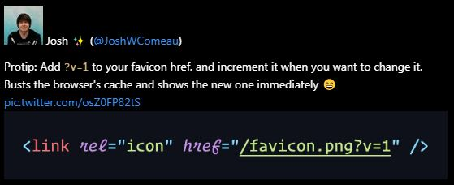

<!-- PROJECT SHIELDS -->
<!-- [![Contributors][contributors-shield]][contributors-url] -->
<!-- [![Forks][forks-shield]][forks-url] -->
[![Stargazers][stars-shield]][stars-url]
[![Issues][issues-shield]][issues-url]
[![MIT License][license-shield]][license-url]
[![LinkedIn][linkedin-shield]][linkedin-url]

<br />
<p align="center">
  <a href="https://github.com/kbravh/tweet-to-markdown">
    
  </a>

  <h3 align="center">Tweet to Markdown</h3>

  <p align="center">
    A command line tool to quickly save tweets as Markdown.
    <br />
    <br />
    <a href="https://github.com/kbravh/tweet-to-markdown/issues">Report a Bug</a>
    ·
    <a href="https://github.com/kbravh/tweet-to-markdown/issues">Request a Feature</a>
  </p>
</p>

<!-- ABOUT THE PROJECT -->

## About The Project

This command line tool allows you to quickly save a tweet in Markdown format. This is great for Zettelkasten note-taking or any other commonplace notebook, vade mecum, Obsidian, Roam, Foam, &c. It is built on the new Twitter v2 API.


## Installing

⚠ **You'll need to have Node.js of at least `v10.x` to use this tool.**

You can install this CLI tool easily by running

```bash
yarn global add tweet-to-markdown
```

or

```bash
npm install --global tweet-to-markdown
```

You can also run it without installing:

```bash
npx tweet-to-markdown
```

<!-- USAGE EXAMPLES -->

## Usage

To use this tool, you'll need to set up an application and get a bearer token on the [Twitter developer dashboard](https://developer.twitter.com/en/portal/dashboard). Once you have the bearer token, either store it in the environment variable `TWITTER_BEARER_TOKEN` or pass it to the command line tool with the `-b` (`--bearer`) flag with each call.

Grabbing a tweet is as easy as calling the `ttm` command and passing in the tweet URL.

```bash
ttm -b <bearer token> https://twitter.com/JoshWComeau/status/1213870628895428611
# Tweet saved as JoshWComeau - 1213870628895428611.md
```

The tweet will be saved to a Markdown file in the current directory. Here's how the tweet will look:



Any attached images, polls, and links will also be linked and displayed in the file.

## Options

### Copy to Clipboard

What if you want to just copy the Markdown to the clipboard instead of saving to a file? Why, it's as simple as just passing the `-c` (`--clipboard`) flag.

```bash
ttm -c https://twitter.com/JoshWComeau/status/1213870628895428611
#Tweet copied to the clipboard.
```

### Custom File Name

In order to save the tweet with a custom filename, pass the desired name to the `--filename` flag. You can use the variables `[[name]]`, `[[handle]]`, and `[[id]]` in your filename, which will automatically be replaced. The file extension `.md` will also be added.

```bash
ttm <tweet url> --filename "[[handle]] - Favicon versioning".
# Tweet saved to JoshWComeau - Favicon versioning.md
```

If the file already exists, an error will be thrown unless you pass the `-f` (`--force`) flag to overwrite the file.

### Custom File Path

To save the tweet to a place other than the current directory, pass the location to the `-p` (`--path`) flag. If this path doesn't exist, it will be recursively created.

```bash
ttm <tweet url> -p "./tweets/"
# Tweet saved to ./tweets/JoshWComeau - 1213870628895428611.md
```

### Tweet Metrics

If you'd also like to record the number of likes, retweets, and replies the tweet has, pass the `-m` (`--metrics`) flag. This will save those numbers in the frontmatter of the file. 

```bash
ttm <tweet url> -m
```
```yaml
---
author: Josh ✨
handle: @JoshWComeau
likes: 993
retweets: 163
replies: 24
---
```

### Save Images Locally

Want to really capture the entire tweet locally? You can pass the `-a` (`--assets`) flag to download all the tweet images as well, instead of just linking to the images on the web. If the tweet is ever deleted or Twitter is unavailable, you'll still have your note.

```bash
ttm <tweet-url> -a
```

Tweet images will be automatically saved to `./tweet-assets`. If you'd like to save the assets to a custom directory, use the `--assets-path` flag and pass in the directory.

```bash
ttm <tweet-url> -a --assets-path "./images"
```


<!-- CONTRIBUTING -->

## Contributing

Contributions are what make the open source community such an amazing place to be learn, inspire, and create. Any contributions you make are **greatly appreciated**.

1. Fork the Project
2. Create your Feature Branch ( `git checkout -b feature` )
3. Commit your Changes ( `git commit -m "Add a cool feature"` )
4. Push to the Branch ( `git push origin feature` )
5. Open a Pull Request

## License

This project is licensed under the MIT License - see the [ `LICENSE` ](LICENSE) file for details

<!-- CONTACT -->

## Contact

Karey Higuera - [@kbravh](https://twitter.com/kbravh) - karey.higuera@gmail.com

Project Link: [https://github.com/kbravh/tweet-to-markdown](https://github.com/kbravh/tweet-to-markdown)

<!-- MARKDOWN LINKS -->
[issues-shield]: https://img.shields.io/github/issues/kbravh/tweet-to-markdown.svg?style=flat-square
[issues-url]: https://github.com/kbravh/tweet-to-markdown/issues
[license-shield]: https://img.shields.io/github/license/kbravh/tweet-to-markdown.svg?style=flat-square
[license-url]: https://github.com/kbravh/tweet-to-markdown/blob/master/LICENSE
[linkedin-shield]: https://img.shields.io/badge/-LinkedIn-black.svg?style=flat-square&logo=linkedin&colorB=555
[linkedin-url]: https://linkedin.com/in/kbravh
[stars-shield]: https://img.shields.io/github/stars/kbravh/tweet-to-markdown.svg?style=flat-square
[stars-url]: https://github.com/kbravh/tweet-to-markdown/stargazers